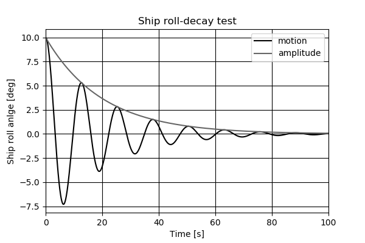

# rolldecay


The repository was used for the work conducted for the paper "Analysis of roll damping_model scale data".
The actual LaTeX paper is however placed [here](https://github.com/martinlarsalbert/A-semi-empirical-method-for-predicting-roll-damping-based-on-machine-learning).

# Summary
Here is a summary of some of the work that has been conducted for the paper [ "Analysis of roll damping_model scale data"](https://github.com/martinlarsalbert/A-semi-empirical-method-for-predicting-roll-damping-based-on-machine-learning). This is mainly for [Martin](https://martinlarsalbert.github.io/blog/about/) to remember, but it is of course open for anyonw to have a look. The data used in this project is unfortunatelly not available in this repo, due to IP-rights and the stored notebooks have consequently no output saved.


## Paper material
* Many of the governig equations have been defined using [SymPy](https://www.sympy.org/) in :[00.1_maa_equation.ipynb](notebooks/rolldecay/rolldecay/02_roll_damping_DB/00.1_maa_equation.ipynb).
* Building the roll damping database was done with [04.2_maa_mdl_db_build.ipynb](notebooks/rolldecay/02_roll_damping_DB/04.2_maa_mdl_db_build.ipynb)
* **Figure 2**: *Number of tests per ship type*: [01.2_maa_ship_selection.ipynb](notebooks/rolldecay/05_new_method/01.2_maa_ship_selection.ipynb)
* **Figure 3**: *Roll decay model test, linear-, quadratic- and cubic-model*: [01.1_maa_mdl_db_damping_classification.ipynb](notebooks/rolldecay/03_roll_damping_classification/01.1_maa_mdl_db_damping_classification.ipynb)
* **Figure 4**: *Root mean square error of roll damping prediction between the SI-method and the modeltest results* : [07.1_maa_simplified_ikeda_compare.ipynb](notebooks/rolldecay/04_simplified_ikeda/07.1_maa_simplified_ikeda_compare.ipynb)
* **Table 1**: *Validation of SI within and outside limits* : [10.2_si_limits.ipyn](notebooks/rolldecay/04_simplified_ikeda/10.2_si_limits.ipynb)
* **Figure 5**: *SI-method with and outside limits vs. model tests*: [10.2_si_limits.ipynb](notebooks/rolldecay/04_simplified_ikeda/10.2_si_limits.ipynb)
* **Figure 6**: *SI-method input parameter variation and data base ships* : [07.3_si_sensitivity2.ipynb](notebooks/rolldecay/04_simplified_ikeda/07.3_si_sensitivity2.ipynb)
* **Figure 7**: *Comparison of SI, Ikeda and model tests* : [07.3_si_sensitivity2.ipynb](notebooks/rolldecay/04_simplified_ikeda/07.3_si_sensitivity2.ipynb)
* **Table 2**: *Validation of SI and Ikeda* : [07.3_si_sensitivity2.ipynb](notebooks/rolldecay/04_simplified_ikeda/07.3_si_sensitivity2.ipynb)
* **Table 3**: *Statistics from cross validations with all models* : [notebooks/rolldecay/05.1_maa_new_method_and_correction.ipynb](notebooks/rolldecay/05.1_maa_new_method_and_correction.ipynb)

## Studies
Studies conducted, where no specific material made it to the paper.
* [00.5_maa_linear_damping_analytical_solution.ipynb](notebooks/rolldecay/02_roll_damping_DB/00.5_maa_linear_damping_analytical_solution.ipynb)
* [05.1_model_test_sensitivity.ipynb](notebooks/rolldecay/02_roll_damping_DB/05.1_model_test_sensitivity.ipynb)
* Exploring the equivalent damping equation $B_e$ in: [08.1_Be_equation.ipynb](notebooks/rolldecay/04_simplified_ikeda/08.1_Be_equation.ipynb) (This one could need more attention)
* Regression: [notebooks/rolldecay/05.1_maa_new_method_and_correction.ipynb](05_new_method/notebooks/rolldecay/05.1_maa_new_method_and_correction.ipynb)
* Original Ikeda method for S175 ship: [01.02_ikeda_S175.ipynb](notebooks/rolldecay/rolldecay/06_ikeda/01.02_ikeda_S175.ipynb)
* Strip theory calculations were done with [ScoresII](https://github.com/martinlarsalbert/pyscores2)


## Logbook
During the later part of this project I started to write a [notebooks/rolldecay/logbook.ipynb](notebooks/rolldecay/logbook.ipynb) each day about the latest findings.

That's all+++


```python

```
