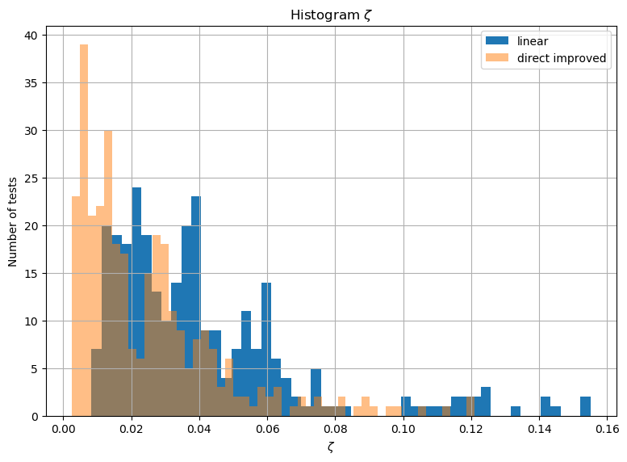
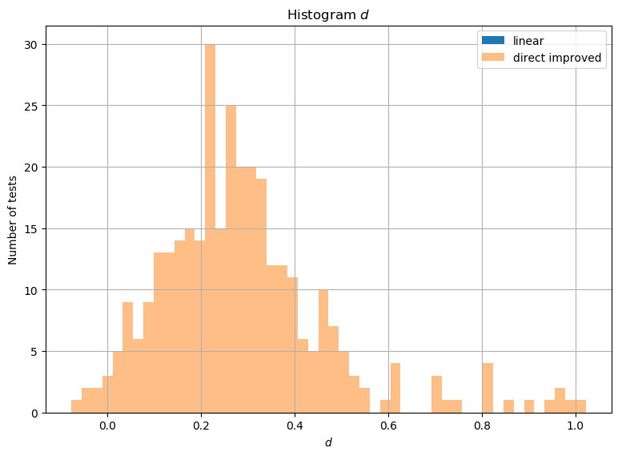

class: center, middle

# DEMOPS: Roll decay
## Status 2020-02-27
---

### The work has been focused on:
--

### Building a roll decay DB
* SQL database with MDL model tests 2007-2020</li>

--

### Measure Rolldamping
* System identification of roll decay test
* Four methods have been tested

--

### Building roll damping DB
* System identification of roll decay DB

---
name: DB
## Building a roll decay DB
---
template: DB

---
template: DB

### MDL DB

The database from MDL currently contains *21243* tests conducted between **2005** and **2017**.

--

<u>Test types:</u> seakeeping, GM, reference speed, **roll decay**, zigzag, turning circle, u turn, spiral, bollard pull, captive, crash stop, wave calibration, pitch decay, surge decay, sway decay, softmooring, williamson turn, heave decay, yaw decay,

--

**407** of the tests are roll decay tests 

---
name: equations
## Measure Rolldamping
---

### General equation for roll decay motion:

$$\displaystyle B \dot{\phi} + I \ddot{\phi} + g m \operatorname{GZ}\left(\phi\right) = M_{x}$$

--

During a roll decay test external moment is zero:

--

$$\displaystyle B \dot{\phi} + I \ddot{\phi} + g m \operatorname{GZ}\left(\phi\right) = 0$$

--

### Linear model

Linearizing the stiffness (ship static stability)

--

$$\displaystyle \operatorname{GZ}\left(\phi\right) = GM \phi$$

--

Linear roll decay equation:

$$\displaystyle B \dot{\phi} + GM g m \phi + I \ddot{\phi} = 0$$

---
template: equations

Damping term $ B $ can be linear:

$$\displaystyle B = \zeta$$

--

or quadratic:

$$\displaystyle B = d \left|{\dot{\phi}}\right| + \zeta$$

---
name: nonlinearity
## Damping nonlinearity
---
template: nonlinearity
The linear model is sometimes too simple:

---
template: nonlinearity

Adding quadratic damping: $B = d \left|{\dot{\phi}}\right| + \zeta$

---
template: nonlinearity

--

* linear model has low score when including large angles

--
* linear model damping $\zeta$ increase for large angles

--
* for quadratic model $d$ increase instead

---
name: varying-stiffness
## Varying stiffness

---
template: varying-stiffness
The linear stiffness assumption is not valid for all ships at large roll angles:

---
template: varying-stiffness

$$\displaystyle \operatorname{GZ}\left(\phi\right) = GM \phi$$

---
template: varying-stiffness

### Natural frequency $ \omega_0 $ for each oscillation

---
template: varying-stiffness

### Adding a quadratic term to the stiffness:

$$\displaystyle \operatorname{GZ}\left(\phi\right) = GM \phi + dGM \phi \left|{\phi}\right|$$

---
name: building-roll-damping-DB
## Building roll damping DB
---

template: building-roll-damping-DB
.right[]
---

template: building-roll-damping-DB
.right[]
---

template: building-roll-damping-DB
.right[]
---

template: building-roll-damping-DB
.right[]
---

template: building-roll-damping-DB
.right[]
---

## Next steps

--

### Regression on roll damping DB
--

### Ikeda method to predict roll damping
--

### Gather more meta data
* Bilge keels
* Inertia
* Hull form (probably takes too much time)

--

### Start writing paper

---
class: center, middle
## End
